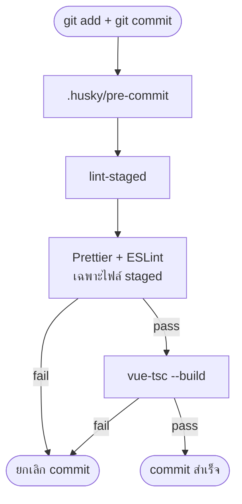

# template-ts-vue3

Vue 3 + TypeScript + Vite template พร้อม Git Hook (Husky) ตรวจคุณภาพโค้ดก่อน commit

## Project Setup

```sh
npm install
```

`npm install` จะลงทะเบียน Git Hook ผ่าน Husky อัตโนมัติ (ดูรายละเอียดด้านล่าง)

### Compile and Hot-Reload for Development

```sh
npm run dev
```

### Type-Check, Compile and Minify for Production

```sh
npm run build
```

---

## Git Hook + Husky

### คืออะไร

| คำศัพท์                                                       | ความหมาย                                                            |
| ------------------------------------------------------------- | ------------------------------------------------------------------- |
| **Git Hook**                                                  | สคริปต์ที่ Git เรียกอัตโนมัติก่อน/หลัง commit, push                 |
| **[Husky](https://typicode.github.io/husky/)**                | ตัวจัดการ hook — เก็บ script ใน `.husky/` แล้ว commit ขึ้น repo ได้ |
| **[lint-staged](https://github.com/lint-staged/lint-staged)** | รัน linter/formatter เฉพาะไฟล์ที่ `git add` แล้ว                    |

Husky ไม่ได้ lint/format เอง — มันแค่ trigger script ใน `.husky/pre-commit` ก่อนสร้าง commit

### Flow การทำงาน



### ขั้นตอนที่รันใน pre-commit

```sh
# .husky/pre-commit
set -e
npm exec lint-staged --verbose   # 1) format + lint
npm run type-check               # 2) type-check ทั้งโปรเจกต์
```

| ลำดับ | เครื่องมือ  | ขอบเขต       | ทำอะไร                                                      |
| ----- | ----------- | ------------ | ----------------------------------------------------------- |
| 1     | lint-staged | ไฟล์ staged  | Prettier → ESLint (auto-fix) สำหรับ `*.{vue,ts,js,mjs,cjs}` |
| 1     | lint-staged | ไฟล์ staged  | Prettier สำหรับ `*.{json,css,md,html}`                      |
| 2     | vue-tsc     | ทั้งโปรเจกต์ | ตรวจ TypeScript / Vue type errors                           |

ถ้าขั้นตอนใดล้มเหลว → commit ถูกยกเลิก โค้ดที่มีปัญหาไม่เข้า Git history

### คำสั่งที่ใช้บ่อย

```sh
npm run validate    # lint + type-check (ไม่ต้อง commit)
npm run lint:check  # lint ทั้งโปรเจกต์
npm run format      # format ทั้ง src/
```

### ข้าม hook (ฉุกเฉินเท่านั้น)

```sh
git commit --no-verify -m "hotfix: emergency"
```

ไม่แนะนำให้ใช้เป็นปกติ — ควรมี CI เป็น safety net

### ไฟล์ที่เกี่ยวข้อง

```
.husky/pre-commit    # hook script
package.json         # prepare, lint-staged config
eslint.config.js     # ESLint rules
```
