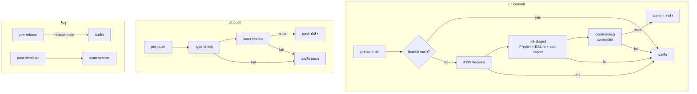

# template-ts-vue3

Vue 3 + TypeScript + Vite template พร้อม Git Hook (Husky) สำหรับ code quality, team policy และ security

## Project Setup

```sh
npm install
```

`npm install` จะลงทะเบียน Git Hook ผ่าน Husky อัตโนมัติ

### Compile and Hot-Reload for Development

```sh
npm run dev
```

### Type-Check, Compile and Minify for Production

```sh
npm run build
```

---

## Git Hook + Husky

### คืออะไร

| คำศัพท์                                                       | ความหมาย                                                            |
| ------------------------------------------------------------- | ------------------------------------------------------------------- |
| **Git Hook**                                                  | สคริปต์ที่ Git เรียกอัตโนมัติก่อน/หลัง commit, push, rebase         |
| **[Husky](https://typicode.github.io/husky/)**                | ตัวจัดการ hook — เก็บ script ใน `.husky/` แล้ว commit ขึ้น repo ได้ |
| **[lint-staged](https://github.com/lint-staged/lint-staged)** | รัน linter/formatter เฉพาะไฟล์ที่ `git add` แล้ว                    |
| **[commitlint](https://commitlint.js.org/)**                  | บังคับรูปแบบ commit message (Conventional Commits)                  |
| **scan-secrets**                                              | scan หา secret (API key, token, credential) ใน `scripts/hooks/`     |

### Hooks ทั้งหมดในโปรเจกต์



### pre-commit — ก่อนสร้าง commit

| ลำดับ | ตรวจอะไร                                                                    | เครื่องมือ                                 |
| ----- | --------------------------------------------------------------------------- | ------------------------------------------ |
| 1     | **ห้าม commit ตรง main/master**                                             | `scripts/hooks/block-protected-branch.mjs` |
| 2     | **ตรวจชื่อไฟล์** — `*.vue` = PascalCase, `*.ts` = camelCase หรือ `index.ts` | `scripts/hooks/check-filenames.mjs`        |
| 3     | **format + lint + sort import** (เฉพาะไฟล์ staged)                          | lint-staged → Prettier, ESLint             |

```sh
# .husky/pre-commit
node scripts/hooks/block-protected-branch.mjs
node scripts/hooks/check-filenames.mjs
npm exec lint-staged --verbose
```

**Sort import** ผ่าน ESLint rule `simple-import-sort/imports` — auto-fix ตอน commit

### commit-msg — ตรวจข้อความ commit

บังคับ [Conventional Commits](https://www.conventionalcommits.org/):

```
<type>(<scope>): <description>

ตัวอย่างที่ผ่าน:
  feat(auth): add login api
  fix(ui): resolve button alignment
  docs: update readme

ตัวอย่างที่ไม่ผ่าน:
  update code
  Fix bug
  WIP
```

```sh
# .husky/commit-msg
npx --no commitlint --edit "$1"
```

### pre-push — ก่อน push ขึ้น remote

| ลำดับ | ตรวจอะไร                               | เครื่องมือ                       |
| ----- | -------------------------------------- | -------------------------------- |
| 1     | **TypeScript type-check** ทั้งโปรเจกต์ | `vue-tsc --build`                |
| 2     | **scan secret** ป้องกัน push key หลุด  | `scripts/hooks/scan-secrets.mjs` |

```sh
# .husky/pre-push
npm run type-check
node scripts/hooks/scan-secrets.mjs
```

### pre-rebase — ก่อน rebase

```sh
# .husky/pre-rebase
node scripts/hooks/block-main-rebase.mjs "$@"
```

ห้าม rebase บน `main` / `master` — แสดง `❌ ห้าม rebase main/master`

### post-checkout — หลังเปลี่ยน branch

scan secret ใน working tree เมื่อ checkout branch ใหม่:

```sh
# .husky/post-checkout (รันเมื่อ checkout branch)
node scripts/hooks/scan-secrets.mjs
```

### Team Policy / Rules

| กฎ                             | Hook          | ผลลัพธ์เมื่อฝ่าฝืน   |
| ------------------------------ | ------------- | -------------------- |
| ห้าม commit ตรง main/master    | pre-commit    | commit ถูกยกเลิก     |
| บังคับ commit format           | commit-msg    | commit ถูกยกเลิก     |
| ห้าม rebase main/master        | pre-rebase    | rebase ถูกยกเลิก     |
| ห้าม push โค้ดที่มี secret     | pre-push      | push ถูกยกเลิก       |
| scan secret หลังเปลี่ยน branch | post-checkout | แจ้งเตือนใน terminal |

### คำสั่งที่ใช้บ่อย

```sh
npm run validate           # lint + type-check (ไม่ต้อง commit)
npm run lint:check         # lint ทั้งโปรเจกต์
npm run format             # format ทั้ง src/
npm run hooks:scan-secrets # scan secret ด้วยตัวเอง
```

### ข้าม hook (ฉุกเฉินเท่านั้น)

```sh
git commit --no-verify -m "feat(ui): your message"   # ข้าม pre-commit + commit-msg
git push --no-verify                                 # ข้าม pre-push
```

ไม่แนะนำให้ใช้เป็นปกติ — ควรมี CI เป็น safety net

### ไฟล์ที่เกี่ยวข้อง

```
.husky/
├── pre-commit       # policy + filename + lint-staged
├── commit-msg       # conventional commits
├── pre-push         # type-check + secret scan
├── pre-rebase       # ห้าม rebase main
└── post-checkout    # secret scan หลังเปลี่ยน branch
scripts/hooks/       # hook scripts ที่ reuse ได้
commitlint.config.js # commit message rules
eslint.config.js     # ESLint + simple-import-sort
package.json         # prepare, lint-staged config
```
